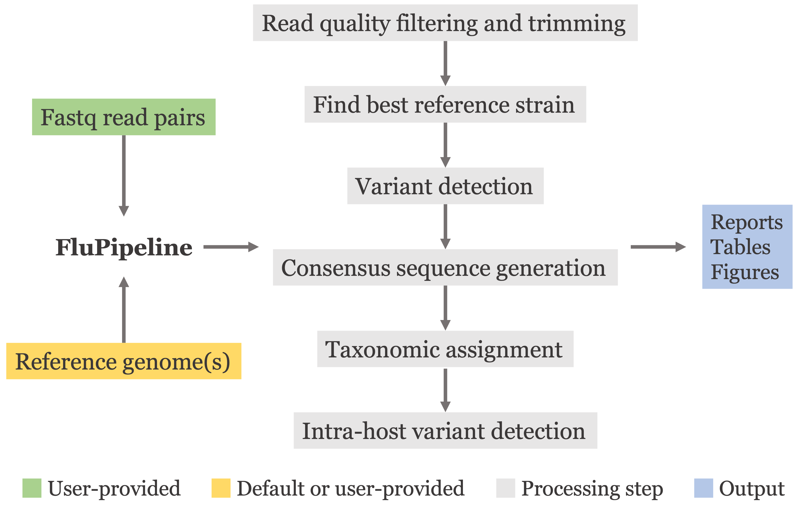

# FluPipeline

`FluPipeline` is a command line program for processing influenza sequencin data. It takes as input a folder of paired-end read files and outputs a folder with data and visualizations.


---

## Overview



**Highlighted Features**

- Detailed tables and figures
- Custom reference strains can be added
- Automatic thread selection selection to run samples in parallel
- Run pipeline only on a subsample of reads
- Automatic testing
- Simple installation

## Installation instructions

Download the FluPipeline repository

Follow the directions below to create a conda environment with all required packages and dependencies.

```
cd /path/to/FluPipeline-main/install

yes | conda env create --name FluPipeline_env --file environment.yml

conda activate FluPipeline_env

yes | Rscript ./r_packages.R

```

## Run a test

Generates synthetic read data and runs FluPipeline on it. Great for making sure everything installed correctly!

```
cd /path/to/FluPipeline-main

conda activate FluPipeline_env

python FluPipeline.py \
--runtest \
--threads 6

```

## Usage examples

Run FluPipeline on fastq files in a folder (--sequence_directory) and outputs to a new folder (--base_directory). Removes the output folder if it already exists (--force, --force_base_directory). Chooses the appropritate number of threads to run samples in parallel based on the assumption one sample will use 8 Gb of memory (--max_mem_per_thread).

### Basic

```
python FluPipeline.py \
--base_directory /path/to/output/folder \
--sequence_directory /path/to/sequence/folder \
--max_mem_per_thread 8

```

### Advances

Use a custom reference directory of fasta files. 

```
python FluPipeline.py \
--base_directory /path/to/output/folder \
--sequence_directory /path/to/sequence/folder \
--force \
--force_base_directory \
--threads 6 \
--cleanup \
--use_fasta \
--reference_directory /path/to/custom/references
```

## Output files

Three main folders within the specified base_directory are created and contain the following.

1. sampleOutputs: Each sample read pair (from here on termed a sample) has a folder with the sample's name containing all files created during processing.

2. sampleResults: Each sample report is copied here for quick access.

3. sampleLogs: A record of how the run for each sample went.


Each run will produce a **run_summary.pdf**  report summarizing read coverage/depth, strain used as reference per sample, and whether errors occurred and for which samples an error occurred. 

Each run also will ouput a **runStats.csv** file.

## Usage Paramters

```
usage: FluPipeline.py [-h] [--base_directory BASE_DIRECTORY]
                      [--reference_directory REFERENCE_DIRECTORY]
                      [--sequence_directory SEQUENCE_DIRECTORY] [--force]
                      [--force_base_directory] [--cleanup] [--threads THREADS]
                      [--runtest] [--strain_sample_depth STRAIN_SAMPLE_DEPTH]
                      [--use_fasta]

optional arguments:
  -h, --help            show this help message and exit
  --base_directory BASE_DIRECTORY
                        directory that run samples will be saved in
  --reference_directory REFERENCE_DIRECTORY
                        directory containing reference strain files (.gb or
                        .fasta (see --use_fasta flag))
  --sequence_directory SEQUENCE_DIRECTORY
                        directory containing fastq sequence files (.gz format)
  --force               overwrite existing files in assemble.R script
  --force_base_directory
                        overwrite existing directory
  --cleanup             remove intermediate files
  --threads THREADS     number of processors to use for multiprocessing
  --runtest             run an in silico test to make sure FluPipeline is
                        working correctly
  --strain_sample_depth STRAIN_SAMPLE_DEPTH
                        number of random reads to use to determine strain
                        assignment. default=2000
  --use_fasta           fasta file(s) containing all eight segments. All
                        segments must have a single name(only letters,numbers, and underscores).
                        At the end of
                        the name there should be an underscore followed by the
                        segment number. E3xample: an_example_name_1.
                        default=False
  ```


# FOR DEVELOPMENT

```
# create a new conda environment call FluPipeLine_envdev
conda create --name FluPipeline_devenv

# enter the environment
source activate FluPipeline_devenv #or conda activate FluPipeline_devenv


# download the following. press y when prompted
conda install -c conda-forge r=3.4.1

#'y'

conda install -c anaconda python=3.6.3

#'y'

pip install biopython numpy pandas

conda install -c bioconda bwa=0.7.15

#'y'

conda install -c bioconda samtools=1.7

#'y'

conda install -c bioconda bcftools=1.8

#'y'

conda install -c bioconda fastp=0.12.4

#'y'

conda install -c bioconda bbmap=38.18

#'y'

conda install -c anaconda ipython

#'y'

conda install -c bioconda nextclade

#'y'

conda install -c conda-forge pandoc

#'y'

## enter R 

R

# download the following. Press an empty space when prompted.

# enter R
R

# set the library that R will download packages to
rlib <- system('which R', intern=TRUE)
rlib <- sub(pattern='/bin/',replacement='/lib/',x=rlib)
rlib <- paste0(rlib,'/library')

#rlib = '/home/agmcfarland/miniconda3/envs/testenv/lib/R/library'

# verify that .libPaths() only includes the conda R library path
.libPaths(rlib)

# download R libraries. Do not update any libraries when prompted.
install.packages('remotes',repos='https://cloud.r-project.org/')
install_version("Rcpp", version = "1.0.7", repos = "http://cran.us.r-project.org", quiet=FALSE)
library(remotes)
install.packages('optparse',repos='https://cloud.r-project.org/', quiet=FALSE)
install.packages('optparse',repos='https://cloud.r-project.org/', quiet=FALSE)
install.packages('ggplot2',repos='https://cloud.r-project.org/', quiet=FALSE)
install.packages('knitr',repos='https://cloud.r-project.org/', quiet=FALSE)
install.packages('kableExtra',repos='https://cloud.r-project.org/', quiet=FALSE)
install.packages('stringr',repos='https://cloud.r-project.org/', quiet=FALSE)
install.packages('dplyr',repos='https://cloud.r-project.org/', quiet=FALSE)
install.packages('tidyverse',repos='https://cloud.r-project.org/', quiet=FALSE)
install_version('latticeExtra','0.6-28',repos='https://cloud.r-project.org/', quiet=FALSE) #2016 version
source("http://bioconductor.org/biocLite.R")
biocLite()
biocLite('ShortRead', suppressUpdates=TRUE, ask=FALSE)
biocLite('genbankr', suppressUpdates=TRUE, ask=FALSE)

q(save="no")

```

Saving conda environment in yml
```
conda env export --name FluPipeline_env > FluPipeline_env.yml
```
